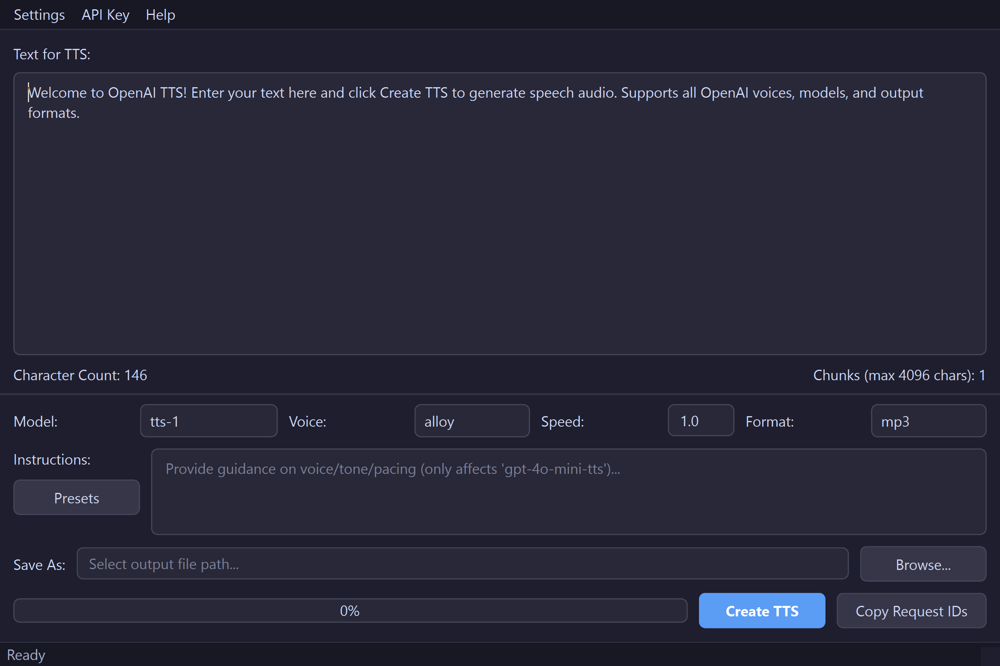

# OpenAI TTS GUI

Desktop app and CLI for generating speech audio from text using OpenAI's TTS API. Handles long text automatically — no character limits.



## Features

- **Models**: `tts-1`, `tts-1-hd`, `gpt-4o-mini-tts`
- **Voices**: alloy, ash, ballad, cedar, coral, echo, fable, marin, onyx, nova, sage, shimmer, verse
- **Formats**: MP3, Opus, AAC, FLAC, WAV, PCM
- **Speed**: 0.25x – 4.0x
- **Instructions**: custom voice/tone guidance for `gpt-4o-mini-tts`
- **Presets**: save and load instruction presets
- **Long text**: automatic chunking with ffmpeg concatenation
- **Live feedback**: character count, chunk count
- **Dark theme**: Fusion-based polished dark UI
- **API key storage**: OS keyring, encrypted file fallback, or environment variable
- **Sidecar metadata**: JSON written next to every output for reproducibility
- **CLI**: `openai-tts --in text.txt --out out.mp3`
- **Request IDs**: copy from GUI for OpenAI support tickets
- **Parallel processing**: set `TTS_PARALLELISM=4` for concurrent chunk generation

## Requirements

- **Python 3.12+** ([download](https://www.python.org/downloads/))
- **ffmpeg** ([download](https://ffmpeg.org/download.html)) — must be on PATH
- **OpenAI API key** ([get one](https://platform.openai.com/api-keys))

## Quick Start

### Option A: Download the installer (Windows)

Download `OpenAI-TTS-Setup.exe` from the [latest release](https://github.com/sm18lr88/OpenAI_TTS_GUI/releases/latest) and run it. ffmpeg is still required on PATH.

### Option B: Run from source

```bash
git clone https://github.com/sm18lr88/OpenAI_TTS_GUI.git
cd OpenAI_TTS_GUI
```

**With [uv](https://docs.astral.sh/uv/) (recommended):**
```bash
uv sync
uv run python -m openai_tts_gui
```

Or use the launch script:
```bash
# Windows
run_gui.bat

# macOS / Linux
./run_gui.sh
```

**With pip:**
```bash
pip install .
python -m openai_tts_gui
```

## Setting Your API Key

1. **Environment variable** (highest priority): set `OPENAI_API_KEY`
2. **GUI**: launch the app → `API Key` menu → `Set/Update API Key...` (stored in OS keyring)
3. **Custom endpoint**: set `OPENAI_BASE_URL` for self-hosted or compatible APIs

## CLI Usage

```bash
openai-tts --in input.txt --out output.mp3 --model tts-1 --voice alloy --format mp3 --speed 1.0
openai-tts --version
```

## Development

```bash
uv sync --extra dev         # install with dev deps
uv run ruff check           # lint
uv run ruff format --check  # format check
uv run pytest               # tests (42 tests, uses .pytest_tmp for temp files)
uv run ty check             # type check
```

### Building

```bash
uv run pyinstaller --noconfirm openai_tts.spec   # .exe in dist/
```

## Project Structure

```
src/openai_tts_gui/
  config/      Settings (pure Python) + Qt theme
  core/        Text chunking, audio concat, ffmpeg, sidecar metadata
  tts/         TTS service (pure Python, no Qt dependency)
  keystore/    API key storage (keyring + encrypted file)
  presets/     Instruction preset persistence
  gui/         PyQt6 UI (main window, dialogs, worker thread, layout)
  errors.py    Domain error hierarchy
  cli.py       CLI entry point
  main.py      GUI entry point
```

See [ARCHITECTURE.md](ARCHITECTURE.md) for module boundaries and conventions.

## Troubleshooting

- **ffmpeg not found**: ensure it's on PATH. The app checks on startup.
- **API key issues**: try setting `OPENAI_API_KEY` environment variable directly.
- **Logs**: check the log file path shown in `Help` → `About`.

## Tips

- Speed adjustments far from 1.0x may impact quality. Use `gpt-4o-mini-tts` with instructions like "speak slowly" for better results.
- Instruction examples at [openai.fm](https://openai.fm).
- `api_key.enc` is obfuscated, not encrypted. Prefer OS keyring or environment variables.
